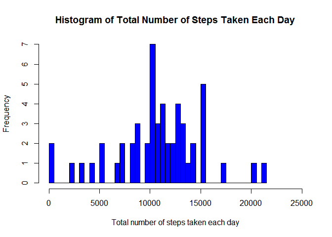
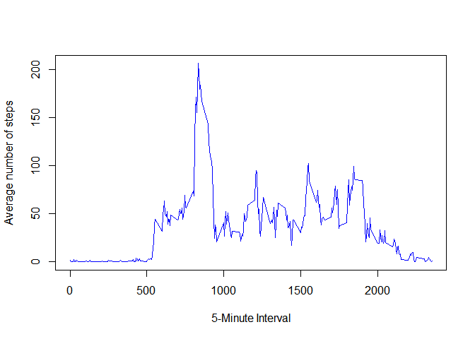
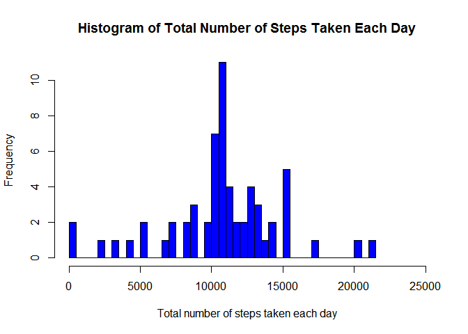
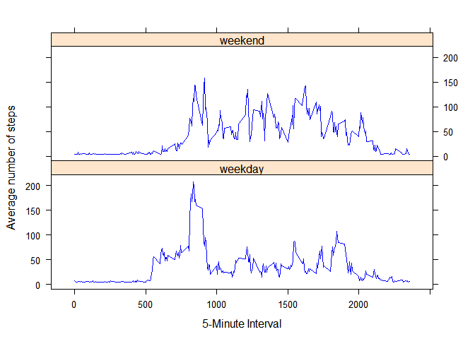

# Reproducible Research: Peer Assessment 1

PA1_template.Rmd Version 1.0

==================================================================

* Author: Po Tak Chow, Teddy
* Email: teddychowpt@gmail.com

==================================================================

#### Introduction

This assignment is to make use of data recorded from a personal activity monitoring device, which collected the data at 5 minute intervals through out the day, to do some statistical analysis and to prepare this report.

The data consists of two months of data from an anonymous user who took measurements on himself regularly during the months of October and November, 2012, including the number of steps taken in 5 minute intervals each day.

The entire assignment is completed in a **single** R markdown document and processed by **knitr** to transform it into a HTML file.

Detailed instructions can be obtained by accessing the link below:

* https://github.com/rdpeng/RepData_PeerAssessment1/blob/master/README.md

#### Data

The data for this assignment is downloaded from the course web site with the link shown as follows:

* Dataset: Activity monitoring data [52KB]

* Link: https://d396qusza40orc.cloudfront.net/repdata%2Fdata%2Factivity.zip

* File Name: activity.csv [342KB]

There are 3 variables are included in this dataset listed as follows:

* **steps**: The number of steps taking in a 5-minute interval (with missing values coded as NA)

* **date**: The date on which the measurement was taken in YYYY-MM-DD format

* **interval**: Identifier for the 5-minute interval in which measurement was taken

Remark: The dataset is stored in a comma-separated-value (CSV) file and totally, 17,568 observations are included in this dataset.

#### Loading and preprocessing the data

Following code is used to load the data from the dataset file ( "activity.csv" ):


```r
dataSet <- "activity.zip"

temp = data.frame()

temp <- read.csv( unz( dataSet, "activity.csv" ), header = TRUE, sep = "," )
```

And following code is used to process the data into a format  which is suitable for analysis use:


```r
temp$date <- as.Date( temp$date, format = "%Y-%m-%d" )

temp$time <- strptime( paste( temp$date, temp$interval %/% 100, 
                              temp$interval %% 100 ), "%Y-%m-%d %H %M" )

## For this part, the missing values in the dataset are ignored.
temp2 <- subset( temp, !( is.na( temp[ "steps" ] ) ) )

## Show the data structure for checking.
str( temp2 )
```

```
## 'data.frame':	15264 obs. of  4 variables:
##  $ steps   : int  0 0 0 0 0 0 0 0 0 0 ...
##  $ date    : Date, format: "2012-10-02" "2012-10-02" ...
##  $ interval: int  0 5 10 15 20 25 30 35 40 45 ...
##  $ time    : POSIXlt, format: "2012-10-02 00:00:00" "2012-10-02 00:05:00" ...
```

```r
## Show the first six rows of data for checking the format.
head( temp2 )
```

```
##     steps       date interval                time
## 289     0 2012-10-02        0 2012-10-02 00:00:00
## 290     0 2012-10-02        5 2012-10-02 00:05:00
## 291     0 2012-10-02       10 2012-10-02 00:10:00
## 292     0 2012-10-02       15 2012-10-02 00:15:00
## 293     0 2012-10-02       20 2012-10-02 00:20:00
## 294     0 2012-10-02       25 2012-10-02 00:25:00
```

```r
## Show the last six rows of data for checking the format.
tail( temp2 )
```

```
##       steps       date interval                time
## 17275     0 2012-11-29     2330 2012-11-29 23:30:00
## 17276     0 2012-11-29     2335 2012-11-29 23:35:00
## 17277     0 2012-11-29     2340 2012-11-29 23:40:00
## 17278     0 2012-11-29     2345 2012-11-29 23:45:00
## 17279     0 2012-11-29     2350 2012-11-29 23:50:00
## 17280     0 2012-11-29     2355 2012-11-29 23:55:00
```

```r
## To process the data to calculate the total number of steps taken per day.
result_data = data.frame()
result_data <- aggregate( steps ~ date, data = temp2, sum )

## Show the data structure for checking.
str( result_data )
```

```
## 'data.frame':	53 obs. of  2 variables:
##  $ date : Date, format: "2012-10-02" "2012-10-03" ...
##  $ steps: int  126 11352 12116 13294 15420 11015 12811 9900 10304 17382 ...
```

```r
## Show the first six rows of data for checking the format.
head( result_data )
```

```
##         date steps
## 1 2012-10-02   126
## 2 2012-10-03 11352
## 3 2012-10-04 12116
## 4 2012-10-05 13294
## 5 2012-10-06 15420
## 6 2012-10-07 11015
```

```r
## Show the last six rows of data for checking the format.
tail( result_data )
```

```
##          date steps
## 48 2012-11-24 14478
## 49 2012-11-25 11834
## 50 2012-11-26 11162
## 51 2012-11-27 13646
## 52 2012-11-28 10183
## 53 2012-11-29  7047
```

#### What is mean total number of steps taken per day?

1. Following is the code used to make a histogram of the total number of steps taken each day:


```r
## Set "LC_TIME" to "English_United States.1252" to ensure the language 
## displayed on the plot is English rather than other languages.
Sys.setlocale("LC_TIME", "English")
```

```
## [1] "English_United States.1252"
```

```r
hist( result_data$steps, col = "blue", 
      main = paste( "Histogram of Total Number of Steps Taken Each Day" ), 
      xlab = "Total number of steps taken each day", ylab = "Frequency", 
      breaks = 50, xlim = c( 0, 25000 ) )
```

 

2. Following code is used to calculate and report the **mean** and **median** total number of steps taken per day:


```r
## Calculate and report the mean total number of steps taken per day.
mean( result_data$steps )
```

```
## [1] 10766.19
```

```r
## Calculate and report the median total number of steps taken per day.
median( result_data$steps )
```

```
## [1] 10765
```

#### What is the average daily activity pattern?

1. Following code is used to make a time series plot  (```type = "l"```) of the 5-minute interval (x-axis) and the average number of steps taken, averaged across all days (y-axis):


```r
## To process the data to calculate the average number of steps taken in each 5-minute interval.
result_data <- aggregate( steps ~ interval, data = temp2, mean )

## Show the data structure for checking.
str( result_data )
```

```
## 'data.frame':	288 obs. of  2 variables:
##  $ interval: int  0 5 10 15 20 25 30 35 40 45 ...
##  $ steps   : num  1.717 0.3396 0.1321 0.1509 0.0755 ...
```

```r
## Show the first six rows of data for checking the format.
head( result_data )
```

```
##   interval     steps
## 1        0 1.7169811
## 2        5 0.3396226
## 3       10 0.1320755
## 4       15 0.1509434
## 5       20 0.0754717
## 6       25 2.0943396
```

```r
## Show the last six rows of data for checking the format.
tail( result_data )
```

```
##     interval     steps
## 283     2330 2.6037736
## 284     2335 4.6981132
## 285     2340 3.3018868
## 286     2345 0.6415094
## 287     2350 0.2264151
## 288     2355 1.0754717
```

```r
plot( result_data$interval, result_data$steps, type = "l", 
      xlab = "5-Minute Interval", ylab = "Average number of steps", 
      col = "blue" )
```

 

2. Following is the code used to find out which 5-minute interval, on average across all the days in the dataset, contains the maximum number of steps:


```r
## Find the maximum number of steps in the dataset.
max( result_data$steps )
```

```
## [1] 206.1698
```

```r
## Find out which 5-minute interval contains the maximum number of steps.
result_data$interval[ which( result_data[ "steps" ] == max( result_data$steps ) ) ]
```

```
## [1] 835
```

#### Imputing missing values

As noted that there are a number of days or intervals where are missing values and coded as ```NA```, the presence of missing days may introduce bias into some calculations or summaries of the data.


```r
## Show the data structure for checking.
str( temp )
```

```
## 'data.frame':	17568 obs. of  4 variables:
##  $ steps   : int  NA NA NA NA NA NA NA NA NA NA ...
##  $ date    : Date, format: "2012-10-01" "2012-10-01" ...
##  $ interval: int  0 5 10 15 20 25 30 35 40 45 ...
##  $ time    : POSIXlt, format: "2012-10-01 00:00:00" "2012-10-01 00:05:00" ...
```

```r
## Show the first six rows of data for checking the format.
head( temp )
```

```
##   steps       date interval                time
## 1    NA 2012-10-01        0 2012-10-01 00:00:00
## 2    NA 2012-10-01        5 2012-10-01 00:05:00
## 3    NA 2012-10-01       10 2012-10-01 00:10:00
## 4    NA 2012-10-01       15 2012-10-01 00:15:00
## 5    NA 2012-10-01       20 2012-10-01 00:20:00
## 6    NA 2012-10-01       25 2012-10-01 00:25:00
```

```r
## Show the last six rows of data for checking the format.
tail( temp )
```

```
##       steps       date interval                time
## 17563    NA 2012-11-30     2330 2012-11-30 23:30:00
## 17564    NA 2012-11-30     2335 2012-11-30 23:35:00
## 17565    NA 2012-11-30     2340 2012-11-30 23:40:00
## 17566    NA 2012-11-30     2345 2012-11-30 23:45:00
## 17567    NA 2012-11-30     2350 2012-11-30 23:50:00
## 17568    NA 2012-11-30     2355 2012-11-30 23:55:00
```

1. Following code is used to calculate and report the total number of rows with ```NA``` marked in the dataset:


```r
## Calculate and report the total number of rows with NA marked in the dataset
length( which( is.na( temp$steps ) ) )
```

```
## [1] 2304
```

2. In order to fill in all of the missing values in the dataset, the mean for that 5-minute interval is selected to be used, and its value is shown as follows:


```r
## Calculate and report the mean for that 5-minute interval.
mean( result_data$steps )
```

```
## [1] 37.3826
```

3. Following is the code used to create a new dataset that is equal to the original dataset, but with the missing data filled in:


```r
new_data = data.frame()

new_data <- temp

## To fill in all of the missing values in the dataset.
new_data$steps[ is.na( new_data$steps ) ] <- mean( result_data$steps )

## Show the data structure for checking.
str( new_data )
```

```
## 'data.frame':	17568 obs. of  4 variables:
##  $ steps   : num  37.4 37.4 37.4 37.4 37.4 ...
##  $ date    : Date, format: "2012-10-01" "2012-10-01" ...
##  $ interval: int  0 5 10 15 20 25 30 35 40 45 ...
##  $ time    : POSIXlt, format: "2012-10-01 00:00:00" "2012-10-01 00:05:00" ...
```

```r
## Show the first six rows of data for checking the format.
head( new_data )
```

```
##     steps       date interval                time
## 1 37.3826 2012-10-01        0 2012-10-01 00:00:00
## 2 37.3826 2012-10-01        5 2012-10-01 00:05:00
## 3 37.3826 2012-10-01       10 2012-10-01 00:10:00
## 4 37.3826 2012-10-01       15 2012-10-01 00:15:00
## 5 37.3826 2012-10-01       20 2012-10-01 00:20:00
## 6 37.3826 2012-10-01       25 2012-10-01 00:25:00
```

```r
## Show the last six rows of data for checking the format.
tail( new_data )
```

```
##         steps       date interval                time
## 17563 37.3826 2012-11-30     2330 2012-11-30 23:30:00
## 17564 37.3826 2012-11-30     2335 2012-11-30 23:35:00
## 17565 37.3826 2012-11-30     2340 2012-11-30 23:40:00
## 17566 37.3826 2012-11-30     2345 2012-11-30 23:45:00
## 17567 37.3826 2012-11-30     2350 2012-11-30 23:50:00
## 17568 37.3826 2012-11-30     2355 2012-11-30 23:55:00
```

4. Following code is used to make a histogram of the total number of steps taken each day:


```r
## To process the data to calculate the total number of steps taken each day.
new_data <- aggregate( steps ~ date, data = new_data, sum )

## Show the data structure for checking.
str( new_data )
```

```
## 'data.frame':	61 obs. of  2 variables:
##  $ date : Date, format: "2012-10-01" "2012-10-02" ...
##  $ steps: num  10766 126 11352 12116 13294 ...
```

```r
## Show the first six rows of data for checking the format.
head( new_data )
```

```
##         date    steps
## 1 2012-10-01 10766.19
## 2 2012-10-02   126.00
## 3 2012-10-03 11352.00
## 4 2012-10-04 12116.00
## 5 2012-10-05 13294.00
## 6 2012-10-06 15420.00
```

```r
## Show the last six rows of data for checking the format.
tail( new_data )
```

```
##          date    steps
## 56 2012-11-25 11834.00
## 57 2012-11-26 11162.00
## 58 2012-11-27 13646.00
## 59 2012-11-28 10183.00
## 60 2012-11-29  7047.00
## 61 2012-11-30 10766.19
```

```r
hist( new_data$steps, col = "blue", 
      main = paste( "Histogram of Total Number of Steps Taken Each Day" ), 
      xlab = "Total number of steps taken each day", ylab = "Frequency", 
      breaks = 50, xlim = c( 0, 25000 ) )
```

 

4. Following code is used to calculate and report the **mean** and **median** total number of steps taken per day:


```r
## Calculate and report the mean total number of steps taken per day.
mean( new_data$steps )
```

```
## [1] 10766.19
```

```r
## Calculate and report the median total number of steps taken per day.
median( new_data$steps )
```

```
## [1] 10766.19
```

By the result shown above, the value of this mean is the same as the estimate from the first part of the assignment, but the value of this median is different from the estimate.

Hence, the impact of imputing missing data on the estimates of the total daily number of steps may cause the estimated median with bias.

#### Are there differences in activity patterns between weekdays and weekends?

For this part, the ```weekdays()``` function and the dataset with the filled-in missing values are used.

1. Following code is used to create a new factor variable in the dataset with two levels - "**weekday**" and "**weekend**" indicating whether a given date is a weekday or weekend day:


```r
new_data <- temp

new_data$steps[ is.na( new_data$steps ) ] <- mean( result_data$steps )

new_data$weekdays <- weekdays( new_data$date )

new_data$weekdays[ which( new_data$weekdays == "Monday" ) ] <- "weekday"
new_data$weekdays[ which( new_data$weekdays == "Tuesday" ) ] <- "weekday"
new_data$weekdays[ which( new_data$weekdays == "Wednesday" ) ] <- "weekday"
new_data$weekdays[ which( new_data$weekdays == "Thursday" ) ] <- "weekday"
new_data$weekdays[ which( new_data$weekdays == "Friday" ) ] <- "weekday"
new_data$weekdays[ which( new_data$weekdays == "Saturday" ) ] <- "weekend"
new_data$weekdays[ which( new_data$weekdays == "Sunday" ) ] <- "weekend"

## Show the data structure for checking.
str( new_data )
```

```
## 'data.frame':	17568 obs. of  5 variables:
##  $ steps   : num  37.4 37.4 37.4 37.4 37.4 ...
##  $ date    : Date, format: "2012-10-01" "2012-10-01" ...
##  $ interval: int  0 5 10 15 20 25 30 35 40 45 ...
##  $ time    : POSIXlt, format: "2012-10-01 00:00:00" "2012-10-01 00:05:00" ...
##  $ weekdays: chr  "weekday" "weekday" "weekday" "weekday" ...
```

```r
## Show the first six rows of data for checking the format.
head( new_data )
```

```
##     steps       date interval                time weekdays
## 1 37.3826 2012-10-01        0 2012-10-01 00:00:00  weekday
## 2 37.3826 2012-10-01        5 2012-10-01 00:05:00  weekday
## 3 37.3826 2012-10-01       10 2012-10-01 00:10:00  weekday
## 4 37.3826 2012-10-01       15 2012-10-01 00:15:00  weekday
## 5 37.3826 2012-10-01       20 2012-10-01 00:20:00  weekday
## 6 37.3826 2012-10-01       25 2012-10-01 00:25:00  weekday
```

```r
## Show the last six rows of data for checking the format.
tail( new_data )
```

```
##         steps       date interval                time weekdays
## 17563 37.3826 2012-11-30     2330 2012-11-30 23:30:00  weekday
## 17564 37.3826 2012-11-30     2335 2012-11-30 23:35:00  weekday
## 17565 37.3826 2012-11-30     2340 2012-11-30 23:40:00  weekday
## 17566 37.3826 2012-11-30     2345 2012-11-30 23:45:00  weekday
## 17567 37.3826 2012-11-30     2350 2012-11-30 23:50:00  weekday
## 17568 37.3826 2012-11-30     2355 2012-11-30 23:55:00  weekday
```

2. Following code is used to make a panel plot containing a time series plot (```type = "l"```) of the 5-minute interval (x-axis) and the average number of steps taken, averaged across all weekday days or weekend days (y-axis):


```r
temp <- new_data

new_data <- aggregate( steps ~ interval + weekdays, data = temp, mean )

library(lattice) 

xyplot( steps ~ interval|weekdays, data = new_data, type = "l", 
        xlab = "5-Minute Interval", ylab = "Average number of steps", 
        col = "blue", layout = c( 1, 2 ) )
```

 
